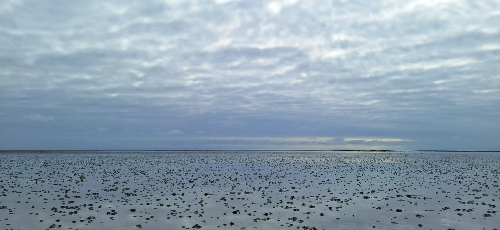

Tidal flats are vital coastal areas regularly shaped by the tides. These ecosystems are important for coastal protection, biodiversity, and local economies, but they are sensitive to extreme weather events, such as heatwaves, which can strongly affect their temperature and ecological function. Recently, the Wadden Sea has experienced mass mortality of bottom-dwelling organisms due to extreme warming. However, we still lack precise data on how sediment temperature changes under different weather conditions, limiting our understanding of how climate change will impact this ecosystem. During this summer school project, you deployed high-frequency temperature loggers along an intertidal gradient to track temperature fluctuations across multiple tidal cycles. You have also taken sediment corers and characterize grain sizes and bulk density properties in the lab. Now it's time to map the spatio-temporal dynamics of intertidal seafloor's thermal variability and develop a simple mechanistic model of the sediment heat budget over the Wadden Sea. Depending on time, you will also investigate how these temperature shifts impact the composition and abundance of local marine fauna.